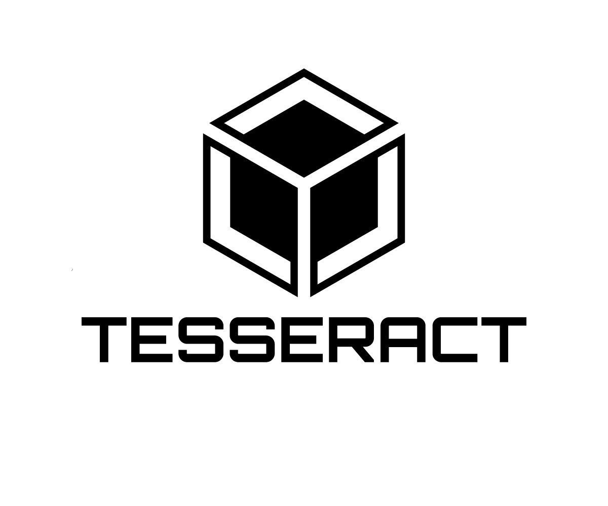

# Hello, I'm Vedant Laxkar! 👋

I'm a passionate data scientist with expertise in Python, AI, and machine learning.

### About Me:
- 🌱 Currently diving into the world of deep learning, mastering Python libraries for advanced data analysis.
- 💻 Actively practicing and refining coding skills, particularly in implementing machine learning algorithms.

- Visit my portfolio for a detailed overview of my projects and skills: 

<!-- ### Social media: 📡    
 -->
 
 <!--

 -->

### 🚀 Skills & Experience Over Time:

- **Machine Learning & Data Science Projects:**  
  Worked on a range of machine learning models including classification, regression, and clustering. Built complete pipelines and explored real-world datasets. Check out my [GitHub projects](https://github.com/vedantlaxkar/SoftRawintern).

- **Deep Learning & Neural Networks:**  
  Built and trained deep learning models using TensorFlow and Keras for tasks like image classification and sequence modeling.

- **Reinforcement Learning:**  
  Explored RL concepts and implemented foundational algorithms to understand reward-based learning and policy optimization.

- **Data Preprocessing & Feature Engineering:**  
  Applied techniques like normalization, encoding, and feature selection to prepare high-quality datasets for modeling.

- **Exploratory Data Analysis (EDA):**  
  Used Pandas, Matplotlib, and Seaborn to discover trends, correlations, and visual insights from complex datasets.

- **Model Evaluation & Optimization:**  
  Evaluated models using metrics like accuracy, precision, recall, F1-score, and ROC-AUC. Tuned hyperparameters using grid search, random search, and cross-validation.

- **Problem-Solving & DSA:**  
  Strengthened logical thinking and algorithmic skills through platforms like LeetCode and HackerRank.

- **SQL for Data Handling:**  
  Gained proficiency in SQL for querying, joining, and managing large datasets in relational databases.

- **Data Pipeline Development:**  
  Understood the workflow of building automated pipelines for data ingestion, transformation, and analysis.

- **Version Control with Git & GitHub:**  
  Experienced in using Git and GitHub for version control, collaboration, and project management.

- **Computer Vision & OCR:**  
  Worked on image processing using OpenCV and text extraction using Tesseract OCR.

- **Libraries & Tools:**  
  `Pandas`, `NumPy`, `Matplotlib`, `Seaborn`, `Scikit-learn`, `TensorFlow`, `OpenCV`, `Tesseract`, `SQL`, `Keras`, `Jupyter`, `Git`, `VS Code`

### Languages and Tools

#### Languages:
| Python3 | 
|---------|
|  |
### Best frameworks and main libraries for Python3:

| TensorFlow | Numpy | Pandas | Sklearn | OpenCV | Tesseract |
|------------|-------|--------|---------|--------|-----------|
|  |  |  |  |  |  |

### My tools for Data Manipulation & Visualisation:

| Conda | Jupyter | MySQL | Matplotlib |
|-------|---------|-------|------------|
|  |  |  |  |

---

  

---

  
  

  

 

